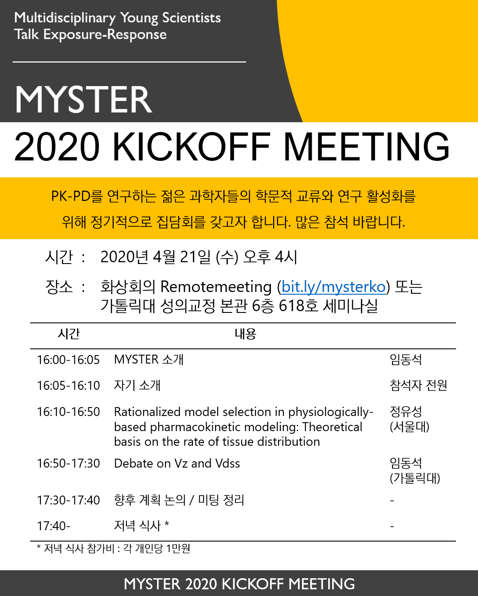

# MYSTER

### Multidisciplinary Young Scientists Talk Exposure-Response

- COVID-19 으로 인해 당분간은 화상회의로 진행합니다. 그러나 이후에는 각 기관에서 오프라인 미팅에 매번 참석하는 것을 원칙으로 하고, 화상회의는 사정상 못오는 분들을 위한 차선의 선택으로 했으면 합니다. 
- 시간은 오후 4시 시작, 연자는 1-2명으로 총 길이는 1.5-2시간 정도 진행합니다.

|차수|날짜|참석인원|링크|
|---|---|---|
|1|2020-04-21|약 20명 (가톨릭대, 서울대, 울산대, 연세대, Qfitter 등)|[화상회의 참석](https://www.remotemeeting.com/reservation/share/2c908ad6715f883301719a6bdb2a6689)|
|2|6월 말 예정|||
|3|TBD|||
|4|TBD|||

#### 2020-04

