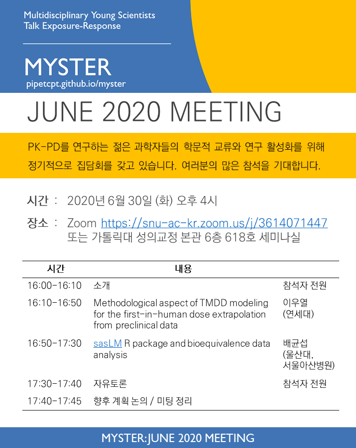

# MYSTER

Multidisciplinary Young Scientists Talk Exposure-Response의 약자로 PK-PD를 연구하는 젊은 과학자들의 학문적 교류와 연구 활성화를 위한 정기적 집담회입니다. 

## 소개

- 누구에게나 열려 있는 모임입니다. [가입인사](https://github.com/pipetcpt/myster/issues/1)를 남겨주시면 감사하겠습니다. (현재 참석자 소속 기관: 가톨릭대, 서울대, 서울아산병원, 울산대, 연세대, Qfitter 등)
- COVID-19 으로 인해 2020년 당분간은 화상회의로 진행합니다. 2022년 6월부터 대면 중심(+ Zoom)으로 전환하였습니다.
- 분기별로 모임을 가지려 합니다. 시간은 오후 4시 시작, 연자는 1-2명으로 총 길이는 1.5-2시간 정도 진행합니다.

## 일정

|차수|날짜|장소|참석인원|
|---|---|---|---|
|1|2020-04-21 Tue|[Remotemeeting 화상회의](https://www.remotemeeting.com/reservation/share/2c908ad6715f883301719a6bdb2a6689) |약 20명 | 
|2|2020-06-30 Tue|[Zoom 화상회의](https://snu-ac-kr.zoom.us/j/3614071447)|약 20명 |
|3|2022-06-08 Wed|대면 모임 (서울대학교 약학대학 하나홀) & [Zoom](http://bit.ly/myster2022) | 약 30명 |
|4|2022-09-22 Wed |대면 모임 (가톨릭대학교 성의교정 옴니버스파크 L003) & [Zoom](http://bit.ly/myster2022) | 약 25명 |
|5|2022-12-12 Mon |대면 모임 (서울아산병원 동관 7세미나실) & [Zoom](http://bit.ly/myster2022)| 약 20명 |
|6|2023-03-29 Wed |대면 모임 (세브란스병원 에비슨 의생명연구센터(ABMRC) 1층 세미나실) | 약 25명 |

## 미팅 기록

#### 2020-04

- 발표 1: 정유성 (서울대) "Rationalized model selection in physiologically-based pharmacokinetic modeling: Theoretical basis on the rate of tissue distribution	"
- 발표 2: 임동석 (가톨릭대) "Debate on Vz and Vdss"
- 기타: [논문 공유](https://github.com/pipetcpt/myster/issues/2)

#### 2020-06 

- 발표 1: 이우열 (연세대) "Methodological aspect of TMDD modeling for the first-in-human dose extrapolation from preclinical data"
- 발표 2: 배균섭 (울산대, 서울아산병원) "sasLM R package and bioequivalence data analysis"

#### 2022-06

- 발표 1: 배형찬 (서울약대) "Modeling of equilibrium dialysis for improved estimation of plasma protein binding of drugs and its application to other matrices"
- 발표 2: 차준석 (연세의대) "오토파지 신호전달경로 모델링"

#### 2022-09

- 발표 1: 최수인 (가톨릭의대) "Tips on Use of Correct Verb Tenses for Non-Native English-speaking Researchers in Scientific Paper"

#### 2022-12

- 발표 1: 배균섭 (울산의대) "2x2 Table 분석"
- 발표 2: 임동석 (가톨릭의대) "학회에서 들을 수 없는 교육과 창업 이야기"

#### 2023-03

- 발표 1: 배균섭 (울산의대) "Likelihood Interval"

