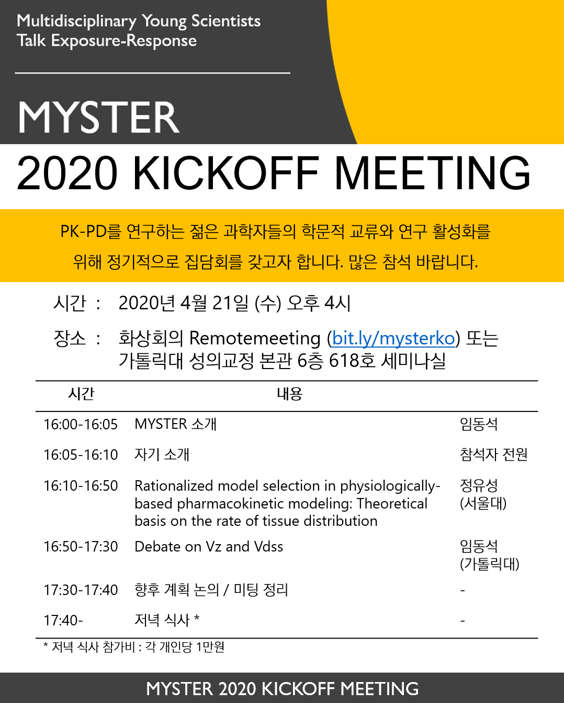
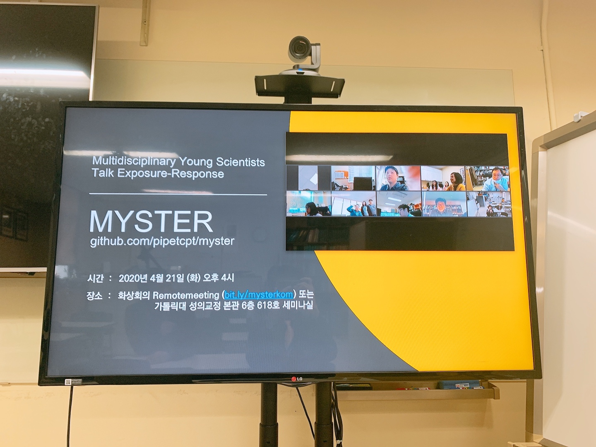

# MYSTER

Multidisciplinary Young Scientists Talk Exposure-Response의 약자로 PK-PD를 연구하는 젊은 과학자들의 학문적 교류와 연구 활성화를 위한 정기적 집담회입니다. 

## 소개

- 누구에게나 열려 있는 모임입니다. [가입인사](https://github.com/pipetcpt/myster/issues/1)를 남겨주시면 감사하겠습니다. (현재 참석자 소속 기관: 가톨릭대, 서울대, 서울아산병원, 울산대, 연세대, Qfitter 등)
- COVID-19 으로 인해 2020년 당분간은 화상회의로 진행합니다.
- 이후에는 각 기관에서 오프라인 미팅에 매번 참석하는 것을 원칙으로 하고, 화상회의는 사정상 못오는 분들을 위한 차선의 선택으로 했으면 합니다. 
- 시간은 오후 4시 시작, 연자는 1-2명으로 총 길이는 1.5-2시간 정도 진행합니다.

## 일정

|차수|날짜|참석인원|링크|
|---|---|---|---|
|1|2020-04-21|약 20명| [Remotemeeting 화상회의 참석](https://www.remotemeeting.com/reservation/share/2c908ad6715f883301719a6bdb2a6689) |
|2|2020-06말 예정|TBD|Remotemeeting 화상회의 예정|
|3|TBD|TBD|TBD|
|4|TBD|TBD|TBD|

## 미팅 기록

#### 2020-04

